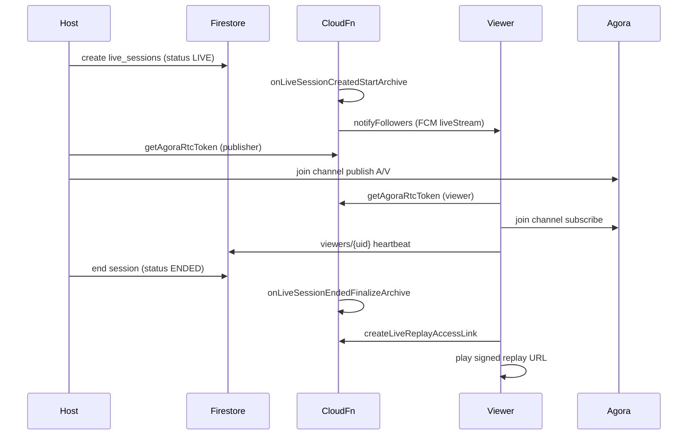

# iOS Live Stream -> Android Parity Guide

Date: 2026-07-08

End-to-end spec for implementing **Live Studio** on Android to match iOS. Use the live iOS app as reference, not `ios-migration/starter/`.

**Primary iOS sources:**
- `VolunteersAppiOS/Core/Repositories/LiveRepository.swift`
- `VolunteersAppiOS/Features/Shared/Live/LiveSessionsView.swift` (includes `MindLoomLiveRoomView`, `LiveAgoraRoomViewModel`, `LiveRoomRealtimeViewModel`)
- `VolunteersAppiOS/Features/Shared/Live/LiveSessionsViewModel.swift`
- `VolunteersAppiOS/Core/Services/LiveBroadcastPrecheckService.swift`
- `VolunteersAppiOS/Core/Services/LiveSessionPushRouter.swift`
- `VolunteersAppiOS/Core/Services/DeepLinkManager.swift`
- Backend: `my-firebase-project/my-firebase-functions/src/index.ts`

**Related:** `ios-migration/ANDROID_SOCIAL_INBOX_PARITY.md` (calls use same `getAgoraRtcToken` with `call_sessions`).

---

## 1. End-to-end loop (high level)



| Phase | Who | What happens |
|-------|-----|----------------|
| **Discover** | Viewer | Live Studio list; filters; hosted vs discover feeds |
| **Host precheck** | Host | Camera/mic/network checks before Go Live |
| **Start** | Host | Write `live_sessions`; archive recording starts server-side |
| **Notify** | Server | Push followers (`liveStream` type) if `notifyFollowers` |
| **Join RTC** | All | `getAgoraRtcToken` -> Agora join (publisher or viewer) |
| **In-room** | All | Comments, likes, viewer presence, stage requests, host tools |
| **Share** | Host | Signed live/replay links; MindLoom LIVE_SESSION post |
| **Deep link** | Viewer | Push/URL -> validate token -> open room |
| **End** | Host | `status: ENDED`; archive finalize; replay becomes available |
| **Replay** | Viewer | Signed JWT replay URL via `createLiveReplayAccessLink` |

---

## 2. Firestore data model

### Collection: `live_sessions/{sessionId}`

Written on host start (`LiveRepository.startLiveSession`):

| Field | Example / notes |
|-------|-----------------|
| `agoraChannelName` | `live-{hostUid}-{unixTimestamp}` |
| `channelName` | Same as above (alias) |
| `hostId`, `hostUid` | Broadcaster uid |
| `hostName`, `hostUsername` | Display identity |
| `title` | Max **120** chars |
| `status` | `LIVE` while active; `ENDED` when finished |
| `chatEnabled` | `true` default; host can toggle |
| `viewAccessMode` | See section 3 |
| `stageAccessMode` | See section 3 |
| `replayVisibility` | See section 3 |
| `notifyFollowers` | `true` default |
| `sourceType` | `standalone` \| `organizer_event` \| `mindloom` |
| `sourceId` | Optional linked event id |
| `sharePath`, `shareUrl` | Canonical web/app share paths |
| `createdAt`, `startTime`, `updatedAt` | Server timestamps |
| `endedAt` | Set on end |
| Archive fields | `archiveStatus`, `archivePrimaryFile`, `archiveObjectPrefix`, etc. (server-managed) |

**Do not** write archive playback URLs on the parent doc from client - server stores private copy under `server_archive/runtime`.

### Subcollections under `live_sessions/{sessionId}`

| Path | Purpose |
|------|---------|
| `comments/{commentId}` | Live room chat overlay |
| `likes/{uid}` | Per-user like |
| `viewers/{uid}` | Presence heartbeat (`lastSeenAt`, `displayName`, `role`, visibility) |
| `blocked_users/{uid}` | Host-blocked viewers |
| `server_archive/runtime` | **Server only** - private archive metadata |

### Collection: `join_requests/{docId}`

Doc id pattern: `{sessionId}_{userId}`.

| Field | Notes |
|-------|-------|
| `streamId` | Live session id |
| `hostId` | Host uid |
| `volunteerId` | Requesting viewer uid |
| `volunteerName` | Display name |
| `status` | `pending` \| `accepted` \| `rejected` \| `canceled` |

---

## 3. Access control enums

### `viewAccessMode`

| Value | Rule |
|-------|------|
| `public` | Any signed-in user |
| `followers_only` | User follows host |
| `invite_only` | User has accepted join request |
| `accepted_event_volunteers` | Approved event application |

### `stageAccessMode`

| Value | Rule |
|-------|------|
| `host_only` | Only host publishes |
| `request_to_join` | Viewer requests; host accepts |
| `approved_volunteers` | Host-approved guests |
| `open_to_accepted_volunteers` | Event guests + accepted requests |

### `replayVisibility`

| Value | Rule |
|-------|------|
| `owner_only` | Host only |
| `shared_link` | JWT share link only |
| `followers_only` | Followers |
| `public` | Any signed-in user |

### Share-link bypass

Signed JWT from `createLiveShareAccessLink` / URL `?token=` bypasses normal watch rules when passed as `shareAccessToken` to:
- `getAgoraRtcToken`
- Client access checks

---

## 4. Cloud Functions (required)

| Callable / trigger | Role |
|--------------------|------|
| `getAgoraRtcToken` | RTC token; enforces watch/stage/block rules; renew on expiry |
| `createLiveShareAccessLink` | Signed live invite URL |
| `createLiveReplayAccessLink` | Signed replay playback/share URL |
| `resolveLiveShareAccess` | HTTP validate share JWT |
| `onLiveSessionCreatedStartArchive` | Start Agora cloud recording |
| `onLiveSessionEndedFinalizeArchive` | Stop recording; set archive ready |
| `onLiveSessionStartedNotifyFollowers` | FCM to followers when status becomes live |
| `reconcileStaleLiveSessions` | Scheduled stale-session cleanup |

All callables use **App Check** enforcement on iOS - Android must match.

### `getAgoraRtcToken` payload (live)

```json
{
  "sessionId": "live_session_doc_id",
  "channelName": "live-uid-timestamp",
  "uid": 0,
  "requestedRole": "viewer" | "publisher",
  "shareAccessToken": "optional_jwt"
}
```

---

## 5. Host flow

### Live Studio UI
- Hero + stats
- Host settings before broadcast:
  - Title
  - View access mode
  - Stage access mode
  - Replay visibility
  - Notify followers toggle
- Precheck sheet:
  - Camera permission + preview
  - Microphone permission
  - Network reachability
- Go Live -> `startLiveSession` -> auto-open full-screen room

### Start session rules
- One active live per host
- Channel name: `live-{hostUid}-{unixTime}`
- Title empty -> `Live Session`

### In-room (host)
- Agora publisher role
- Right icon rail: like, comment, tools, invite, MindLoom, mic, camera, flip, chat toggle, end stream
- Host tools: access modes, replay visibility, join requests, blocked viewers, share live/replay, MindLoom

---

## 6. Viewer flow

### Discovery
- Live Studio shows live + ended sessions
- Filter: All / Live / Scheduled / Ended
- Search title, host, channel
- Hide blocked hosts

### Join room
1. Tap session -> full-screen room
2. Realtime listeners for session, comments, likes, viewers, join requests
3. Auto-join if session active and user not blocked
4. `getAgoraRtcToken` with `requestedRole: viewer` and `shareAccessToken` if present
5. Agora subscriber role
6. Heartbeat writes `viewers/{uid}`

### Viewer actions
- Like
- Comment (<= 500 chars) if `chatEnabled`
- Request stage / join stage / leave stage
- Mute stream audio / speaker route

---

## 7. Agora integration

| Concern | Android parity target |
|---------|-----------------------|
| Host role | `CHANNEL_PROFILE_LIVE_BROADCASTING` + broadcaster |
| Viewer role | Audience |
| Stage guest | Re-request token as publisher |
| Token renewal | Refresh on `onTokenPrivilegeWillExpire` |
| Reconnect | Max 2 attempts |
| Leave | Suppress reconnect on intentional leave |

**Critical:** Pass `shareAccessToken` when arriving via invite link.

---

## 8. Realtime listeners

| Listener | Path | UI use |
|----------|------|--------|
| Session doc | `live_sessions/{id}` | LIVE/ENDED badge, settings |
| Comments | `.../comments` | Overlay + sheet |
| Likes | `.../likes` | Heart count |
| Viewers | `.../viewers` | Viewer count |
| Blocked | `.../blocked_users` | Moderation |
| Join requests | `join_requests` by `streamId` + `hostId` | Host approval queue |
| User request | `join_requests` by `streamId` + `volunteerId` | Pending/accepted state |

Viewer presence stale threshold: **90 seconds**.

---

## 9. Push notifications & deep links

### Follower push

Payload should include:
- `type: liveStream`
- `sessionId` / `referenceId`
- `hostId` / `actorId`

### Deep links
- `volunteersapp://live?sessionId=...&hostId=...&token=...`
- `https://softsolutionstech.com/live?...`

### Open-from-push logic
1. Refresh session list
2. If token present, validate share access
3. Fetch session or build stub from token resolution
4. Validate host
5. If still live -> open room with `shareAccessToken`
6. If ended + replay ready -> open replay

---

## 10. Share & MindLoom

### Invite audience
`createLiveShareAccessLink(sessionId)` -> signed URL

### Share to MindLoom
- Signed URL
- Post payload uses `mediaType: LIVE_SESSION`
- Success toast: **Shared to MindLoom.**

### Replay share
- After `archiveStatus == READY`
- Use `createLiveReplayAccessLink`

---

## 11. Archive & replay

- Session created -> archive starts
- Session ended -> archive finalizes
- Parent doc uses `archiveStatus: READY`
- Client playback must use `createLiveReplayAccessLink`

---

## 12. Reliability & edge cases

| Case | Behavior |
|------|----------|
| Ghost session | Scheduled stale-session cleanup |
| Token expiry | Renew before expiry |
| Network drop | Reconnect up to 2 times |
| Invite-only without token | Deny watch in UI + server |
| Session ended while in room | Leave Agora cleanly |

---

## 13. Acceptance checklist

### Host
- [ ] Precheck before Go Live
- [ ] Correct `live_sessions` fields
- [ ] Publish A/V via Agora
- [ ] Toggle chat, moderate viewers, approve join requests
- [ ] Share live link and MindLoom live post
- [ ] End stream -> ENDED -> leave channel

### Viewer
- [ ] Discover live sessions with access rules
- [ ] Auto-join subscriber role
- [ ] Comments, likes, stage request flow
- [ ] Open from `liveStream` push
- [ ] Open from share link with `token`
- [ ] Watch replay via signed URL

### Server integration
- [ ] `getAgoraRtcToken` supports `shareAccessToken`
- [ ] Archive becomes READY after end
- [ ] Follower push on go-live
- [ ] App Check on callables

---

## 14. What NOT to do

- Do not store or play raw archive URLs from the parent doc
- Do not skip `shareAccessToken` for invite-only viewers
- Do not allow publisher role without server approval
- Do not use `ios-migration/starter/` as the implementation source
- Do not conflate `live_sessions` with `call_sessions`
